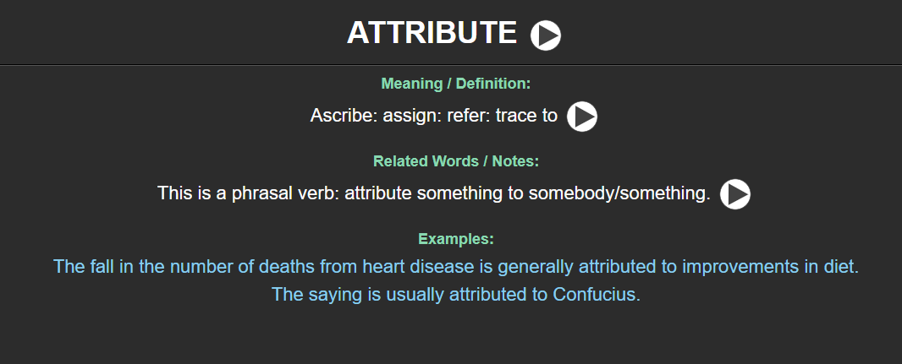

# English Vocabulary Anki Deck Generator

This project allows you to automatically generate Anki decks for learning English vocabulary. All you need is a CSV file with your chosen words, their meanings, synonyms, antonyms, and examples. The script will then create a professional Anki deck, complete with audio for each word and its synonyms, generated using Google Text-to-Speech.

---



## 🚀 Features

- **CSV to Anki**: Automatically converts CSV files into importable Anki `.apkg` files.
- **Sub-deck Support**: Create a main deck with multiple sub-decks by simply providing several CSV files.
- **Rich Card Format**: Each card is designed for effective learning, with the word on the front and detailed information on the back.
- **Automatic Audio**: Each word and its synonyms have audio automatically generated using Google's Text-to-Speech service, which helps with pronunciation.
- **Customizable**: The project structure is clear, allowing for easy customization of the card template and functionality.

---

## 📄 CSV File Format

To generate the Anki deck, your CSV files must follow a specific format. The script will process each CSV file named `Ch{i}.csv` (e.g., `Ch1.csv`, `Ch2.csv`, etc.) and create a corresponding sub-deck.

Each CSV file must include the following columns:

- `Index`: A unique identifier for the row.
- `Word`: The vocabulary word you want to learn.
- `Part of Speech`: The grammatical category of the word (e.g., VERB, ADJECTIVE).
- `Meaning Definition`: Synonyms or a clear definition of the word.
- `Antonym`: Words with the opposite meaning (optional).
- `Examples`: One or more example sentences. If you have multiple examples, they **must** be separated by `<br>`.
- `Related Words Notes`: Any additional notes or related words (optional).

### ✅ CSV Example

```csv
Index,Word,Part of Speech,Meaning Definition,Antonym,Examples,Related Words Notes
0,ABERRANT,ADJECTIVE,"Unusual; unacceptable; atypical; abnormal",,Aberrant behavior/trees/weather,
1,ACCELERATE,VERB,"Speed up; expedite; has",decelerate,"measures to accelerate the rate of economic growth<br>The car accelerated",
2,ACCOUNT,VERB,"Explain; clarify; rationalize; illuminate; justify",,"Recent pressure at work may account for his behavior.<br>Can you account for your actions?",
3,ACKNOWLEDGE,VERB,"Accept; admit; concede; confess; grant; profess; re",,"The family acknowledge the need for change.<br>He acknowledges that he was wrong.",
4,ADJACENT,ADJECTIVE,"Next; adjoining; neighboring; close",,"We stayed in adjacent rooms.<br>the building adjacent to the library",
```

---

## 🛠️ How to Use
### 1. Setup

- First, clone the repository and navigate into the project directory.

### 2.  Create and activate a virtual environment (optional but recommended)

```bash
python -m venv .venv
source .venv/bin/activate  # On Windows, use `.venv\Scripts\activate`

```


#### Install dependencies

```bash
pip install -r requirements.txt
```

### 3. Prepare your CSV files
- Create one or more CSV files following the format described above.
- Name your files sequentially: `Ch1.csv`, `Ch2.csv`, `Ch3.csv`, etc.
- Place all CSV files in a designated folder (e.g., `input/`).

### 4. Run the script
- Execute the main Python script to start the deck generation process.

```bash
python main.py
```

- The script will read each CSV file, download necessary audio files using Google TTS, and package everything into an Anki `.apkg` file.

### 5. Import into Anki
- Once the script finishes, you’ll find an `.apkg` file in the `output/` directory.
- Open Anki > `File` > `Import` and select the generated file.
- A new deck will be created with all your vocabulary words, ready for studying!

---

## 🧠 Anki Card Structure

Each generated card will have the following layout:

### **Front:**
- The vocabulary word.

### **Back:**
- Part of Speech
- Meaning / Definition (with audio)
- Antonym(s)
- Example Sentence(s)
- Related Notes (if any)

---

## 🤝 Contributing

Contributions are welcome!  
If you have ideas for new features or improvements, feel free to:
- Open an issue
- Submit a pull request

---

## 📄 License

This project is licensed under the **MIT License**.

---
